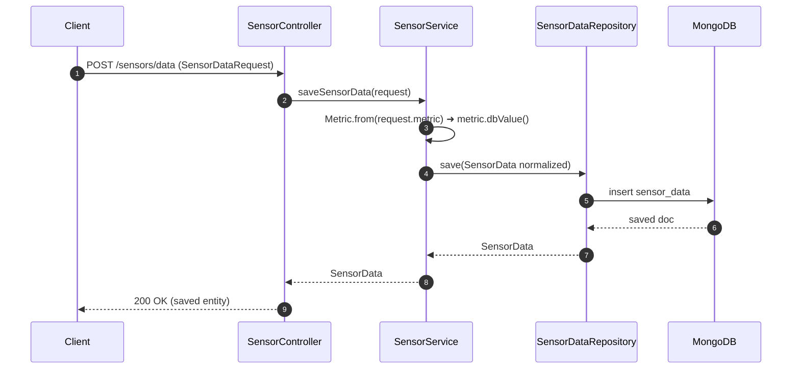
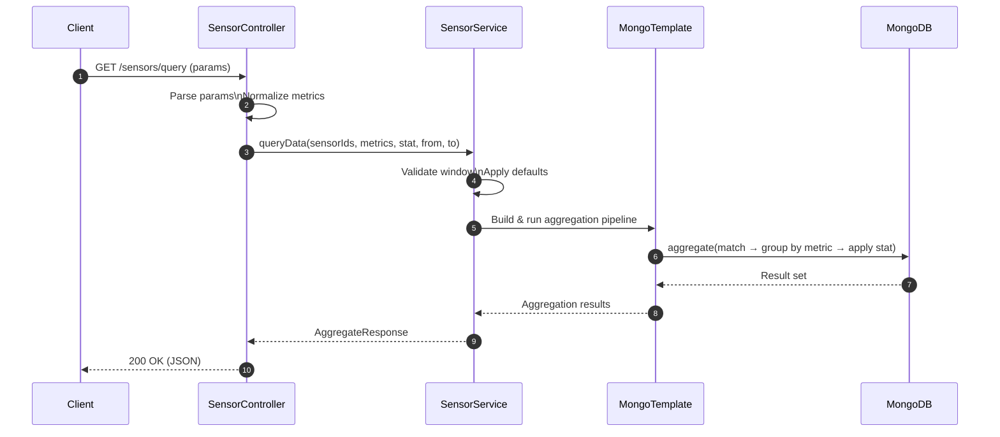

## Sequence Diagrams

The following are sequence diagrams for the Weather Metrics API.

### Ingest reading (POST /sensors/data)

```mermaid
sequenceDiagram
  autonumber
  participant C as Client
  participant Ctrl as SensorController
  participant Svc as SensorService
  participant Repo as SensorDataRepository
  participant DB as MongoDB

  C->>Ctrl: POST /sensors/data (SensorDataRequest)
  Ctrl->>Svc: saveSensorData(request)
  Svc->>Svc: Metric.from(request.metric) ➜ metric.dbValue()
  Svc->>Repo: save(SensorData normalized)
  Repo->>DB: insert sensor_data
  DB-->>Repo: saved doc
  Repo-->>Svc: SensorData
  Svc-->>Ctrl: SensorData
  Ctrl-->>C: 200 OK (saved entity)
```

  ### Query aggregates (GET /sensors/query)

```mermaid
sequenceDiagram
  autonumber
  participant Client
  participant Controller as SensorController
  participant Service as SensorService
  participant MongoT as MongoTemplate
  participant Mongo as MongoDB

  Client->>Controller: GET /sensors/query (params)
  Controller->>Controller: Parse params\nNormalize metrics
  Controller->>Service: queryData(sensorIds, metrics, stat, from, to)
  Service->>Service: Validate window\nApply defaults
  Service->>MongoT: Build & run aggregation pipeline
  MongoT->>Mongo: aggregate(match → group by metric → apply stat)
  Mongo-->>MongoT: Result set
  MongoT-->>Service: Aggregation results
  Service-->>Controller: AggregateResponse
  Controller-->>Client: 200 OK (JSON)
```

